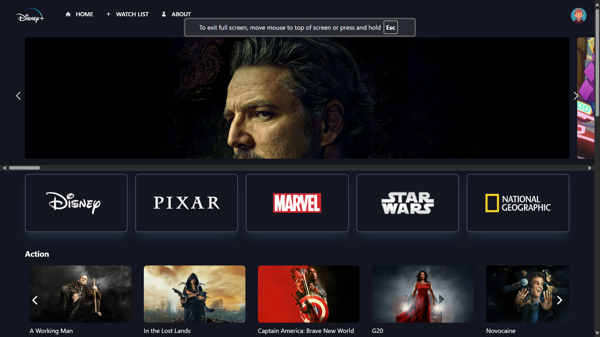
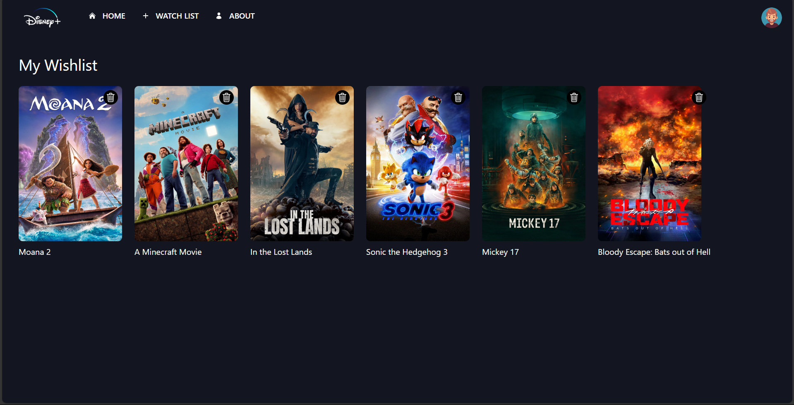
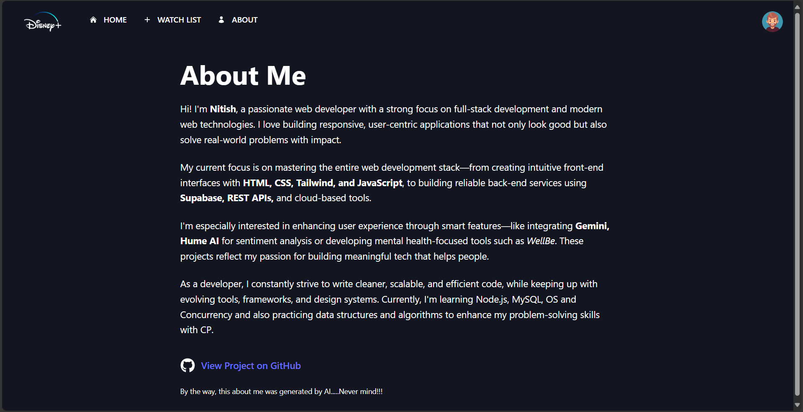

[](https://github.com/ThereIsSomething/disney_clone/archive/refs/heads/master.zip) [](https://disney-thereissomething-nitish.vercel.app/) [](https://www.paypal.me/NBhambu)

# 🎬 Movie Wishlist

## ✨ Curate your own personalized movie watchlist by [Nitish Kumar Bhambu](https://github.com/ThereIsSomething/disney_clone.git)

### 📌 Acknowledgments

- TMDB API used for fetching movie data.
- Web API’s `localStorage` used for persisting wishlist across sessions.
- Deployed on **Vercel** with Vercel Analytics integrated.
- Used Context API for state management.
- Tailwind CSS for styling.
- React Router DOM for routing.
- React Icons for icons.

<div align="center">
  <br>
  
  

  <br>
</div>

### Features :sparkles:

🎥 **Movie Cards**: Add movies to your wishlist with a single click

💾 **LocalStorage Sync**: Persist your watchlist even after page reloads

💡 **User Feedback**: Smart alerts to confirm movie actions (added/duplicate)

⚡ **Responsive UI**: Fully mobile-ready layout with TailwindCSS

🧠 **Intelligent Design**: Planned with clean UI/UX principles and smart state management via React Context API

---

## 🚀 Getting Started

### Prerequisites
- Node.js (v14+)
- TMDB API Key (Free)

### Installation

```bash
git clone https://github.com/ThereIsSomething/
cd movie-wishlist
npm install
```

### Setup

Create a `.env` file in the root directory and add:

```env
VITE_TMDB_API_KEY=your_tmdb_key
```

### Run

```bash
npm run dev
```

---

## 🔍 Details

Live Demo 👉 [https://disney-thereissomething-nitish.vercel.app/](https://disney-thereissomething-nitish.vercel.app/)

- Explore trending movies
- Add/remove movies to your wishlist
- No account required — purely client-side
- Works offline with `localStorage`

---

## 🛠 Built With

* React.js
* Tailwind CSS
* React Router DOM
* TMDB API

---

## 👨‍💻 Author

### Developer
* [**Nitish Kumar Bhambu**](https://github.com/ThereIsSomething)

---

## 📄 License

This project is licensed under the [MPL-2.0 License](http://mozilla.org/MPL/2.0/) - see the [LICENSE](LICENSE) file for details.

---

## 💡 Inspiration

* Disney+ UI clone concepts
* Clean, minimalist UI.
* Efficient state management patterns
